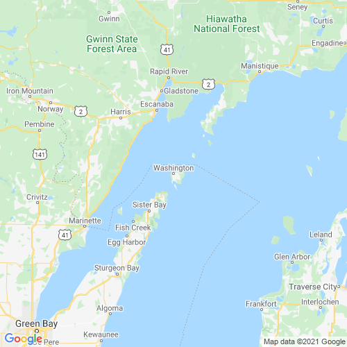

# Call of Cthulhu: Legend of the Nine | The Call from a Lone Island  
**Vicente Manuel Munoz Milchorena**  
<vicente.mm.milchorena@gmail.com>  
**v1.0, 2021-09-04**

---

## The Call from a Lone Island | Warning

The following document is a piece of fiction. It speaks of Lovecraftian horror and situations that may be sensitive to some people. It is recommended to read and consider that these situations, while fictional, can have a detrimental effect on certain people.

It is recommended not to be played by people that may have experienced some of the traumatic situations or do not wish to go through these traumatic experiences even if they are in a controlled environment.

---

## The Call from a Lone Island | Introduction

**Year:** 1923  
**Location:** Wisconsin, United States  
**Situation:** Missing Agent of the Orange Bureau

Investigator, you have been summoned by the powers of the Orange Bureau, an organization working for the Department of Defense through a secret contract.

Our task is to investigate paranormal phenomena and control side-effects these events may have in the world, keeping humanity safe and helping us understand better in order to fend off that which comes for us.

One of our agents has stopped reporting in the Wisconsin area. His name is Alfred Stoker, a former United States Armed Forces Corporal that served in the [Big Red One](https://en.wikipedia.org/wiki/1st_Infantry_Division_(United_States)) during the biggest operation the United States had seen until that point.

Alfred Stoker had been serving the Orange Bureau by investigating a situation developing in Washington Island, last reported as being a sighting of a cult which may have ties to the Silver Tree—an organization first seen by the Orange Bureau during the Great War after a rescue operation.

The mission requires that a group of investigators travel to the island to find agent Stoker and assess the situation. In the case of his decease, it is important to investigate the reason of death and continue the previous investigation.

Agent Stoker provided the following information which may prove useful in finding him.

---

## The Call from a Lone Island | Letters from Alfred Stoker

```
May 9th, 23.
Arrived at Washington Island, there is not much to see here but Anna Marie
mentioned that there was a presence in this island which she could
trace back to the Silver Tree.

Nuddleman has been informed, Ishmael is also aware but is still working
overseas on other matters which concern the Bureau more.

I am unaware of what I am to find but I am worried, the last time I heard
about the Silver Tree was from Ishmael and he was very clear to be
cautious.

If I could have brought the damn Army I would have, instead I have my
service Colt 1911 which may put a stop to anything that walks in two
or four legs... I hope.

May 17th, 23.
Either Anna Marie was wrong or the Silver Tree is blending inside the island,
there is nothing to see here aside from the little town with people rarely
coming in or out of the island.

I have come in contact with a local by the name of Wilheim Strauss, an old
Kraut that has been living in the island for some time who was somewhat
unaware of the fact that a war was fought and lost by the German Empire...

Somewhat shocking but I cannot blame him, barely anything seems to arrive
here, including news, which makes me a breath of fresh air for the people
living in this place.

This man is considerably lucid for his age, a man that is in his late sixties,
and has informed me about most of the important things happening in this island
which is not much to say considering the small population or the location.

Regardless of this contact and other locals I have spoken with none seem to
be aware of anything strange happening in the area, a child did mention something
but it was a prank and ended up looking like a fool from believing him.

The kid was disappointed though but I still believe that I was just a
distraction for him and a very active mind.

May 23rd, 23.
I am about to give up on my investigation, I have found nothing and Ana Marie
came back to me on a letter that took longer than usual to move back and
forth through the known channels, we are both intrigued by this more than
the current situation with the Silver Tree.

We are considering this a lost cause at the moment, I will remain here until
the end of May and write my final report.

Ana Marie is considering visiting Washington Island to investigate the reason
of the delay with the information, having to communicate through conventional
mail is rather annoying and almost impossible in my current situation.

I will have to leave through the conventional means to avoid raising any
suspicions from the local population, they have become rather fond of me and
would be too strange for them that I just vanished one day without even the
ferryman knowing anything about my departure.

Also a reminder, these investigations are starting to become rather pointless,
half the time we are not finding anything or we are responding to situations
that have nothing of value or provide little additional information to our
current knowledge.

The only good thing that I did find here was alcohol, turns out Canadians
are bringing them in and no one is making a deal about it.

I would rather have a good whiskey, but it's better to have some whiskey
than none I guess.
```

---

## The Call from a Lone Island | Suspicious Point

A final suspicious point was provided to Agent Stoker: there is a shipwreck on the coast of Door County, the [SS Louisiana](https://en.wikipedia.org/wiki/SS_Louisiana), which sank there in 1913.

While this has remained undisturbed for almost ten years, this incident may be something important to investigate—but do evaluate it as you move along with your priorities once in location.

---

## The Call from a Lone Island | Dreams

Anna Marie mentioned her dreams to Agent Stoker. We also have this information stored for our consideration.

```
I was at a beach, it was beautiful but terrifying also, to see such a vast
body of water, controlled but at the same time voracious and ready to attack
only to defend itself.

There stood the Maiden of the Silver Mask, she observed the distance where
the Guardian of the Beach, the massive wall with eyes in geometrical shapes,
stood as if waiting for us to do a crass move.

Alas I hesitated, she did also, but there was much respect that we had for
the ocean and the ocean respects those who dares not push themselves onto it,
this is why sailors sometimes find untimely deaths.

The call came, from the distance, but not for me, not for the Maiden, it was
simply a lure to catch fools in the waves and spit them back as corrupted
spirits...

I can see them, the shadowmen walking on the beaches, their souls have been
sucked of anything that mattered and now they roam without purpose, only to
continue draining life from the creatures walking the Earth.

It is there, somewhere in that island there is something that calls and guides,
I know it but I cannot reach it, why is it hidden?
```

---

## The Call from a Lone Island | Map of the Surrounding Area


